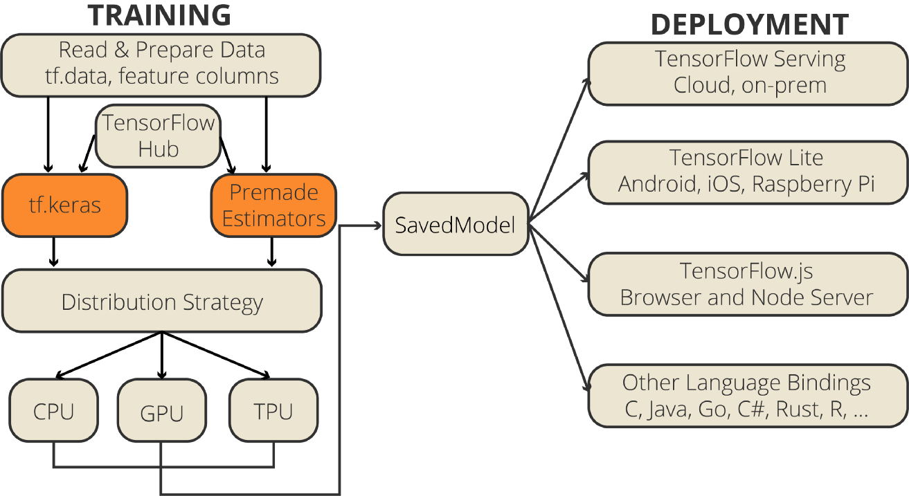
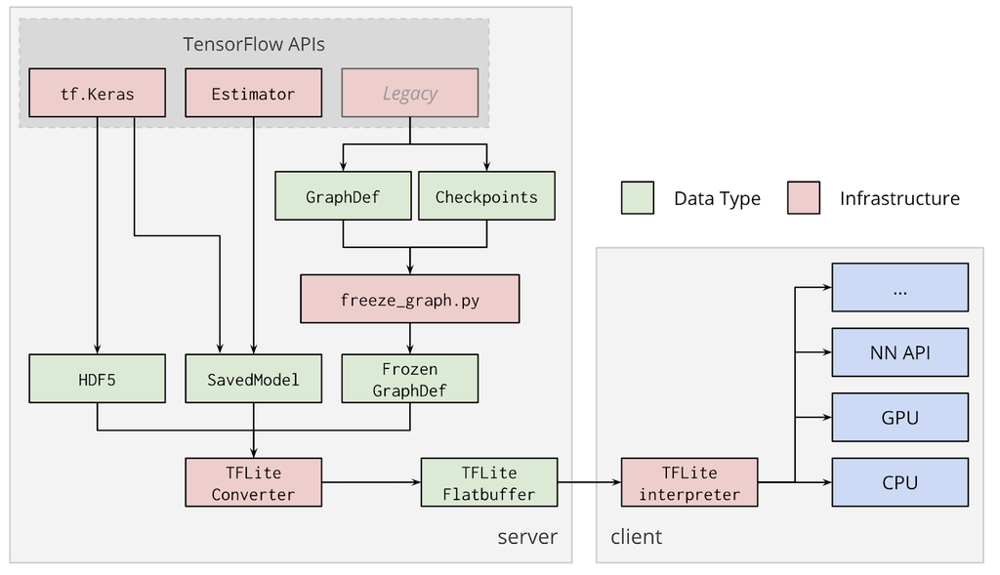

# What
* It is TensorFlow's lightweight solution for mobile and embedded devices
  * It enables low-latency inference 
    * a model need to be optimized first
    * Some hardware accelerators (e.g., Edge TPU) can run inference faster with models that have been correctly optimized
  * With a smaller binary size
    * because it has no training code 
    * a smaller binary size means
      * less memory
      * less storage
      * less downloading time
  * Latency reduction
    * because we don't have to talk to server everytime we want to do inference
      * it also means lower computation and lower power consumption
* It is `NOT` in seperate repo on github, it is in the same repo with TensorFlow
* We need to convert a TensorFlow model to TensorFlow Lite format and optimize it for on-device inference

# Cons
* Optimizations can `potentially` result in changes in model accuracy

# Architecture

# How to convert
* The TensorFlow Lite converter takes a TensorFlow model and generates a TensorFlow Lite model (an optimized [FlatBuffer](https://google.github.io/flatbuffers/) format identified by the .tflite file extension)
  * Python API (recommended)
  * Command line tool (This only supports basic model conversion)

## FlatBuffer
* It is an efficient cross platform serialization library 
* It was originally created at Google for performance-critical app

## vs Protocol Buffer
* Protocol Buffers is similar to FlatBuffers, with the difference being that FlatBuffers does not need a `parsing` / `unpacking` step to a secondary representation before you can access data

### vs JSON
![img/flatbuffer.jpeg]

